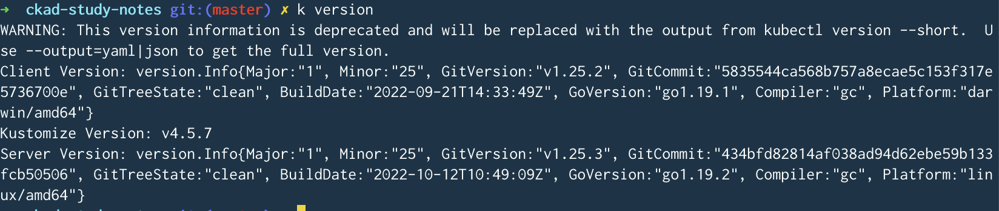

# API Deprecation Policy

Created: March 13, 2023 3:59 PM

# The Kubernetes API

This interface is essential for communicating with Kubernetes, as we rely on the `kubectl` command for all interactions with the platform. It is crucial to stay informed about any updates to `kubectl` in order to ensure our systems remain up-to-date and fully functional.

```bash
kubectl get pods
```

# What is Deprecation?

Kubernetes will send warnings whenever new updates are released.



# Deprecation Policy Highlights

- `apiVersion`: indicates which version of the API it is designed to be compatible with.
- Deprecation Window: Once deprecated, GA released API versions are supported for 12 months or 3 releases.
- Migration Guide: for details on API changes with each version of Kubernetes.

# Where to find Deprecation Info

[https://kubernetes.io/docs/reference/using-api/deprecation-policy/](https://kubernetes.io/docs/reference/using-api/deprecation-policy/)

[https://kubernetes.io/docs/reference/using-api/deprecation-guide/](https://kubernetes.io/docs/reference/using-api/deprecation-guide/)

# Hands-On Demonstration

1. **We can use kubectl to show the installed K8s version:**

```bash
k version
```

The K8s version is written as `Major.Minor.Patch`.

1. **Write the Api Group of *Deployments* into `/root/group` .**

```bash
k explain deployment
```

This will show `VERSION: apps/v1` .

The version is displayed as `VERSION: {group}/{version}`.