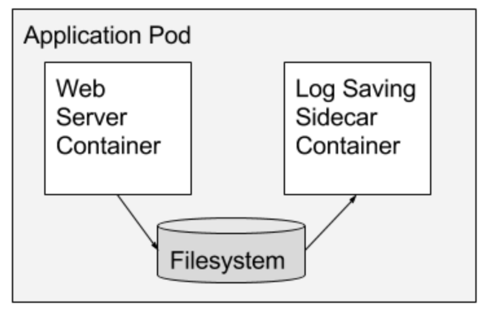
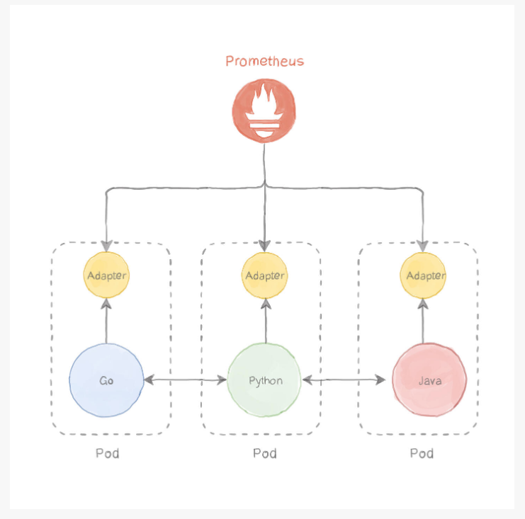

# Multi-Container Pods

Created: March 2, 2023 9:49 AM

# What is a Multi-Container Pod?

A Kubernetes Pod can have multiple containers within the same Pod. Although it’s possible to include multiple containers within a Kubernetes Pod, it’s not a widely used practice. Kubernetes has established design patterns that outline when it’s appropriate to use multi-container pods.

# Multi-Container Design Patterns

These are the use cases that we can find in the Kubernetes official doc:

- Sidecar containers ([reference](https://kubernetes.io/blog/2015/06/the-distributed-system-toolkit-patterns/)): In other words, “help” the main container. Sidecar containers can help reduce the workload of the main container by handling tasks that are not core to its function. The sidecar container runs alongside the main container and both work together to achieve the desired outcome.
    
    
    
- Ambassador, proxies, bridges, or adapter containers ([reference](https://kubernetes.io/blog/2015/06/the-distributed-system-toolkit-patterns/)): This pattern is useful when you have two pods that communicate with each other, and you sometimes get timeouts or need to retry requests. Rather than duplicating the logic on both pods, you can use a sidecar proxy container to handle requests, with built-in logic for retrying and timing out requests if necessary.
    
    ```mermaid
    graph TD
      PodA --> SideCarProxy
    	PodB --> SideCarProxy
    ```
    
- Adapter: Standardize and normalize output. Imagine, we are using Prometheus (a service to monitor applications that check not only if an application is working, but also if it is working “as expected”). Prometheus works by querying an endpoint exposed by the application. The endpoint must return data in a format that Prometheus expects. We can have a sidecar container that it’s only purpose is to translate the output from the application’s endpoint to a format that Prometheus accepts and understands.
    
    
    

# When to use Multi-Container Pods?

We should use multi-container Pods when our containers are tightly coupled, meaning, they share resources like network and storage volumes.

# Hands-on demonstrations

### Create a multi-container pod that includes two containers. The first container should be a busybox container that write data to a shared volume, while the second container should print the data to the console.

```yaml
apiVersion: v1
kind: Pod
metadata:
  name: exercise1
spec:
  containers:
  - name: writer
    image: busybox:stable
    command: ['sh', '-c', 'echo "hello jose" > /output/data.txt; while true; do sleep 5; done']
    volumeMounts:
    - name: shared
      mountPath: /output
  - name: sidecar
    image: busybox:stable
    command: ["sh", "-c", "while true; do cat /input/data.txt; sleep 5; done"]
    volumeMounts:
    - name: shared
      mountPath: /input
  volumes:
  - name: shared
    emptyDir: {}
```

### Exercise 2.

1. Create a deployment with two containers: a main container and a sidecar container.
2. The main container should be a simple web server that serves a static HTML file. You can use any image of your choice for this container.
3. The sidecar container should be an Nginx server that acts as an ambassador for the main container. The Nginx server should be configured to route all incoming traffic to the main container. You can use the official Nginx image for this container.
4. Expose the deployment using a Kubernetes service so that the static HTML file can be accessed from outside the cluster.
5. Test the deployment by accessing the static HTML file through the service's ClusterIP.

```yaml
apiVersion: apps/v1
kind: Deployment
metadata:
  name: ambassador-sidecar
spec:
  replicas: 1
  selector:
    matchLabels:
      app: ambassador-sidecar
  template:
    metadata:
      labels:
        app: ambassador-sidecar
    spec:
      containers:
      - name: main-container
        image: nginx
        ports:      
        - containerPort: 81
        volumeMounts:
        - name: nginx-main-config
          mountPath: /etc/nginx/conf.d
      - name: sidecar-container
        image: nginx
        ports:
         - containerPort: 80
        volumeMounts:
        - name: nginx-config
          mountPath: /etc/nginx/conf.d
      volumes:
      - name: nginx-config
        configMap:
          name: nginx-config
          items:
          - key: default.conf   
            path: default.conf
      - name: nginx-main-config
        configMap:
          name: nginx-main-config
          items:
          - key: default.conf
            path: default.conf
---
apiVersion: v1
kind: ConfigMap
metadata:
  name: nginx-config
data:
  default.conf: |
    server {
      listen 80;
      location / {
        proxy_pass http://localhost:81;
      }
    }
---
apiVersion: v1
kind: ConfigMap
metadata:
  name: nginx-main-config
data:
  default.conf: |
    server {
      listen 81;
      listen [::]:81;
      server_name localhost;
      
      location / {
        root /usr/share/nginx/html;
        index index.html index.htm;
      }
    }
---
apiVersion: v1
kind: Service
metadata:
  name: ambassador-sidecar
spec:
  selector:
    app: ambassador-sidecar
  ports:
  - name: http
    port: 80
    targetPort: 80
```