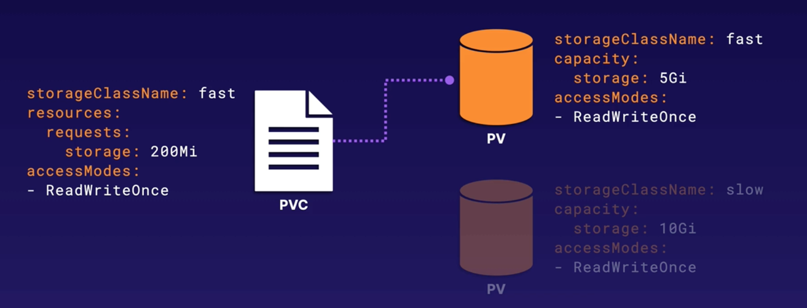
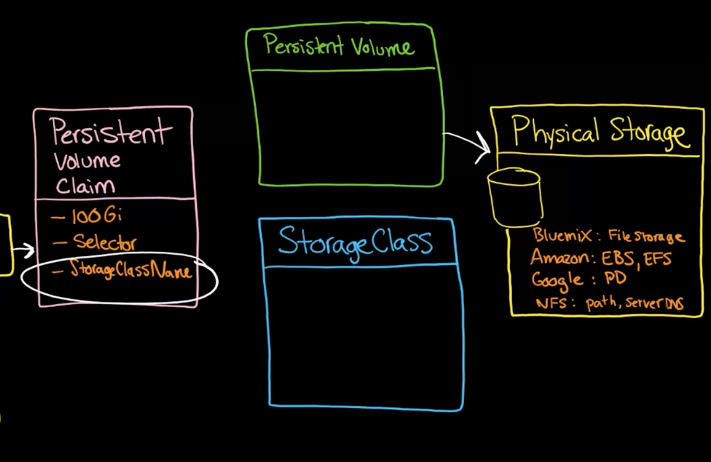

# Kubernetes Volumes

Created: March 7, 2023 10:15 AM

# What is Kubernetes Volume?

In Kubernetes, Pods are designed to be ephemeral, meaning they can come and go. However, if you have a Pod that is saving data to disk and you want to preserve that data even if the Pod is deleted or recreated, you can use Kubernetes Volumes. Volumes allow you to maintain the “state” of your Pod, so you can reuse the data in future Pods.

# Types of volumes

## emptyDir

As the name says, this is an empty directory that will get created on the Pod’s container. This exists as long as the Pod is running on the node, meaning that if the Pod gets deleted or recreated, the volume would also be gone. All containers in the Pod can read and write to the same files in the `emptyDir` volume, they can also provide a different path in each container.

```yaml
apiVersion: v1
kind: Pod
metadata:
  name: test-pd
spec:
  containers:
  - image: nginx:stable
    name: test-container
    volumeMounts:
    - mountPath: /cache
      name: cache-volume
  volumes:
  - name: cache-volume
    emptyDir: {}

```

## hostPath

If the volume is not empty and you want to link data from your node to the Pod, you can use `hostPath`. Essentially, a `hostPath` volume mounts a file or directory from the host node’s filesystem into the Pod.

```yaml
apiVersion: v1
kind: Pod
metadata:
  name: test-pd
spec:
  containers:
  - image: nginx:stable
    name: test-container
    volumeMounts:
    - mountPath: /test-pd
      name: test-volume
  volumes:
  - name: test-volume
    hostPath:
      # directory location on host
      path: /data
      # this field is optional
      type: Directory
```

## Cloud Volumes

This volume type specifies that we want to connect to a cloud volume, for example, AWS Elastic Blockstore. This type of volume is not recommended in production since the user (who’s creating the YAML) needs to know low-level details that shouldn’t be concerned or is too sensible and expose high-security risk. This has also been deprecated by Kubernetes.

## NFS

An `nfs` volume allows an existing NFS (Network File System) share to be mounted into a Pod. Unlike `emptyDir`, which is erased when a Pod is removed, the contents of an `nfs` volume are preserved and the volume is merely unmounted. This means that an NFS volume can be pre-populated with data, and that data can be shared between pods. NFS can be mounted by multiple writers simultaneously.

<aside>
💡 You must have your own NFS server before you can use it.

</aside>

## Persistent Volumes

### `PersistentVolumes`

This is the storage that has been provisioned by an administrator.

### `PersistenceVolumeClaims`

Provides an API for users and administrators to abstract details of how storage is provided and how it is consumed.

PersistenceVolumeClaims (PVC) automatically bind to a PersistentVolume (PV) that meets their criteria.



- StorageClassName: static or dynamic. If you don’t provide one, you will default to static which is the Persistent Volume.
- You can have multiple Pods using the same PVC.
- Users deal with PVC, and administrators with PV.



# Hands-on demonstration

**1. Create a Pod that uses two containers: one that writes data to an emptyDir volume, and another that reads that data and writes it to standard output. Use the same techniques as in the previous exercise to write data to the volume, and use the cat command to read data from the volume.**

```yaml
apiVersion: v1
kind: Pod
metadata:
  name: emptydir-exercise-1
spec:
  restartPolicy: OnFailure
  containers:
  - name: writer
    image: busybox:stable
    command: ['sh', '-c', 'echo "you can do it!" > /data/data.txt']
    volumeMounts:
    - mountPath: /data
      name: emptydir-vol
  - name: reader
    image: busybox:stable
    command: ['sh', '-c', 'cat /data/data.txt']
    volumeMounts:
    - mountPath: /data
      name: emptydir-vol
  volumes:
  - name: emptydir-vol
    emptyDir: {}
```

**2. Create a Deployment that uses an emptyDir volume to store shared data between multiple replicas of a Pod. Mount the volume at /data inside the container. Use a shell script to write data to the volume, and have multiple replicas of the Pod running the same script simultaneously. Observe how the data is shared between the replicas.**

```yaml
apiVersion: apps/v1
kind: Deployment
metadata:
  name: emptydir-exercise-2
  labels:
   exercise: two
spec:
  replicas: 3
  selector:
    matchLabels:
      exercise: two
  template:
    metadata:
      labels:
        exercise: two
    spec:
      initContainers:
      - name: init-container
        image: busybox:stable
        command: ['sh', '-c', 'echo "Hello, World!" > /data/hello.txt']
        volumeMounts:
        - name: emptydir-vol
          mountPath: /data
      containers:
      - name: emptydir-containers
        image: busybox:stable
        command: ['sh', '-c', 'cat /data/hello.txt']
        volumeMounts:
        - name: emptydir-vol
          mountPath: /data
      volumes:
      - name: emptydir-vol
        emptyDir: {}
```

**3.** 

**The application is managed by the `app-processing` Deployment in the `default` Namespace. Use a PersistentVolume to mount data from the k8s host to the application's container. The data is located at `/etc/voldata` on the host. Set up the PersistentVolume to access this data using directory mode.**

**For the PersistentVolume, set a capacity of `1Gi`. Set the access mode to `ReadWriteOnce`, and set the storage class to `host`.**

**For the PersistentVolumeClaim, set the storage request to `100Mi`. Mount it to `/data` in the container.**

**Note: The application is set up to read data from the PersistentVolumeClaim's mounted location, then write it to the ephemeral volume location, and read it back from the ephemeral volume to the container log. This means that if everything is set up properly, you see the `Hive Key` data in the container log!**

```yaml
apiVersion: v1
kind: PersistentVolume
metadata:
  name: app-processing-pv
spec:
  storageClassName: host
  capacity:
    storage: 1Gi
  accessModes:
  - ReadWriteOnce
  hostPath:
    path: /etc/voldata
---
apiVersion: v1
kind: PersistentVolumeClaim
metadata:
  name: app-processing-pvc
spec:
  storageClassName: host
  accessModes:
    - ReadWriteOnce
  resources:
    requests:
      storage: 100Mi
```

```yaml
# Please edit the object below. Lines beginning with a '#' will be ignored,
# and an empty file will abort the edit. If an error occurs while saving this file will be
# reopened with the relevant failures.
#
apiVersion: apps/v1
kind: Deployment
metadata:
  annotations:
    deployment.kubernetes.io/revision: "3"
    kubectl.kubernetes.io/last-applied-configuration: |
      {"apiVersion":"apps/v1","kind":"Deployment","metadata":{"annotations":{},"name":"app-processing","namespace":"default"},"spec":{"replicas":1,"selector":{"matchLabels":{"app":"processing"}},"template":{"metadata":{"labels":{"app":"processing"}},"spec":{"containers":[{"command":["sh","-c","while true; do cat /data/hivekey.txt \u003e /tempdata/hivekey.txt; cat /tempdata/hivekey.txt; sleep 5; done"],"image":"radial/busyboxplus:curl","name":"busybox","securityContext":{"readOnlyRootFilesystem":true}}]}}}}
  creationTimestamp: "2023-03-07T16:54:14Z"
  generation: 3
  name: app-processing
  namespace: default
  resourceVersion: "2139"
  uid: 5b637f4b-aed4-493f-9e47-25f56230c552
spec:
  progressDeadlineSeconds: 600
"/tmp/kubectl-edit-1576226257.yaml" 84L, 2888C                                                     1,1           Top
# Please edit the object below. Lines beginning with a '#' will be ignored,
# and an empty file will abort the edit. If an error occurs while saving this file will be
# reopened with the relevant failures.
#
apiVersion: apps/v1
kind: Deployment
metadata:
  annotations:
    deployment.kubernetes.io/revision: "3"
    kubectl.kubernetes.io/last-applied-configuration: |
  creationTimestamp: "2023-03-07T16:54:14Z"
  generation: 3
  name: app-processing
  namespace: default
  resourceVersion: "2139"
  uid: 5b637f4b-aed4-493f-9e47-25f56230c552
spec:
  progressDeadlineSeconds: 600
  replicas: 1
  revisionHistoryLimit: 10
  selector:
    matchLabels:
      app: processing
  strategy:
    rollingUpdate:
      maxSurge: 25%
      maxUnavailable: 25%
    type: RollingUpdate
  template:
    metadata:
      creationTimestamp: null
      labels:
        app: processing
    spec:
      containers:
      - command:
        - sh
        - -c
        - while true; do cat /data/hivekey.txt > /tempdata/hivekey.txt; cat /tempdata/hivekey.txt;
          sleep 5; done
        image: radial/busyboxplus:curl
        imagePullPolicy: IfNotPresent
        name: busybox
        resources: {}
        securityContext:
      labels:
        app: processing
    spec:
      containers:
      - command:
        - sh
        - -c
        - while true; do cat /data/hivekey.txt > /tempdata/hivekey.txt; cat /tempdata/hivekey.txt;
          sleep 5; done
        image: radial/busyboxplus:curl
        imagePullPolicy: IfNotPresent
        name: busybox
        resources: {}
        securityContext:
          readOnlyRootFilesystem: true
        terminationMessagePath: /dev/termination-log
        imagePullPolicy: IfNotPresent
        name: busybox
        resources: {}
        securityContext:
          readOnlyRootFilesystem: true
        terminationMessagePath: /dev/termination-log
        terminationMessagePolicy: File
        volumeMounts:
        - mountPath: /tempdata
          name: emptydir-vol
        - mountPath: /data
          name: app-pvc
      dnsPolicy: ClusterFirst
      restartPolicy: Always
      schedulerName: default-scheduler
      securityContext: {}
      terminationGracePeriodSeconds: 30
      volumes:
      - emptyDir: {}
        name: emptydir-vol
      - name: app-pvc
        persistentVolumeClaim:
          claimName: app-processing-pvc
                                                                                                   48,1          68%
```